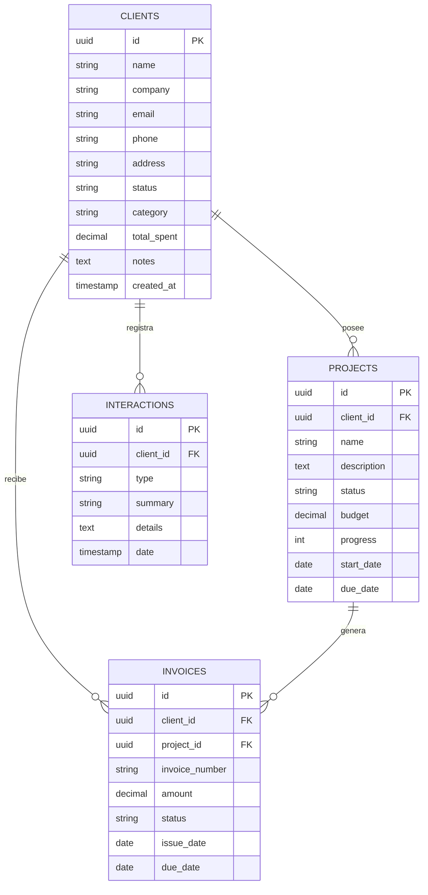

# 🚀 Guía de Configuración e Implementación del Backend Supabase

Este documento contiene la **guía paso a paso y la especificación técnica completa** para crear, configurar y conectar la base de datos de **Supabase** para la aplicación **ClienteFlow CRM**. 

Puedes compartir o cargar este documento en cualquier otra sesión o conversación para continuar el desarrollo o realizar modificaciones avanzadas.

---

## 📌 1. Arquitectura de la Base de Datos (PostgreSQL en Supabase)

La aplicación requiere 4 tablas principales vinculadas relacionalmente:



---

## 🛠️ 2. Pasos para Crear el Backend en Supabase

### Paso 1: Crear el Proyecto en Supabase
1. Ingresa a **[supabase.com](https://supabase.com)** e inicia sesión con tu cuenta (o regístrate gratis).
2. Haz clic en **"New Project"**.
3. Asigna un nombre (ej. `clientflow-crm`), selecciona tu región más cercana y define una contraseña segura para la base de datos.
4. Espera ~1 minuto a que Supabase aprovisione la base de datos PostgreSQL.

---

### Paso 2: Ejecutar el Script SQL de Creación de Tablas
1. En el panel lateral izquierdo de tu proyecto en Supabase, ve a **SQL Editor**.
2. Haz clic en **"New query"**.
3. Copia y pega todo el bloque de código SQL presentado a continuación y presiona **"Run"**:

```sql
-- ===================================================
-- SCRIPT DE INICIALIZACIÓN: CLIENTEFLOW CRM (SUPABASE)
-- ===================================================

-- 1. Extensión para UUIDs
CREATE EXTENSION IF NOT EXISTS "uuid-ossp";

-- 2. Tabla de Clientes (clients)
CREATE TABLE IF NOT EXISTS public.clients (
    id UUID PRIMARY KEY DEFAULT uuid_generate_v4(),
    name VARCHAR(255) NOT NULL,
    company VARCHAR(255) NOT NULL,
    email VARCHAR(255) UNIQUE NOT NULL,
    phone VARCHAR(50),
    address TEXT,
    status VARCHAR(50) DEFAULT 'active' CHECK (status IN ('active', 'inactive', 'lead', 'vip')),
    category VARCHAR(50) DEFAULT 'Pyme' CHECK (category IN ('Enterprise', 'Pyme', 'Startup', 'Individual')),
    total_spent DECIMAL(12, 2) DEFAULT 0.00,
    notes TEXT,
    created_at TIMESTAMP WITH TIME ZONE DEFAULT timezone('utc'::text, now()) NOT NULL,
    updated_at TIMESTAMP WITH TIME ZONE DEFAULT timezone('utc'::text, now()) NOT NULL
);

-- 3. Tabla de Proyectos (projects)
CREATE TABLE IF NOT EXISTS public.projects (
    id UUID PRIMARY KEY DEFAULT uuid_generate_v4(),
    client_id UUID NOT NULL REFERENCES public.clients(id) ON DELETE CASCADE,
    name VARCHAR(255) NOT NULL,
    description TEXT,
    status VARCHAR(50) DEFAULT 'in_progress' CHECK (status IN ('planning', 'in_progress', 'completed', 'on_hold')),
    budget DECIMAL(12, 2) DEFAULT 0.00,
    progress INT DEFAULT 0 CHECK (progress >= 0 AND progress <= 100),
    start_date DATE DEFAULT CURRENT_DATE,
    due_date DATE,
    created_at TIMESTAMP WITH TIME ZONE DEFAULT timezone('utc'::text, now()) NOT NULL
);

-- 4. Tabla de Facturas (invoices)
CREATE TABLE IF NOT EXISTS public.invoices (
    id UUID PRIMARY KEY DEFAULT uuid_generate_v4(),
    client_id UUID NOT NULL REFERENCES public.clients(id) ON DELETE CASCADE,
    project_id UUID REFERENCES public.projects(id) ON DELETE SET NULL,
    invoice_number VARCHAR(100) NOT NULL UNIQUE,
    amount DECIMAL(12, 2) NOT NULL DEFAULT 0.00,
    status VARCHAR(50) DEFAULT 'pending' CHECK (status IN ('paid', 'pending', 'overdue')),
    issue_date DATE DEFAULT CURRENT_DATE,
    due_date DATE,
    items_summary TEXT,
    created_at TIMESTAMP WITH TIME ZONE DEFAULT timezone('utc'::text, now()) NOT NULL
);

-- 5. Tabla de Interacciones (interactions)
CREATE TABLE IF NOT EXISTS public.interactions (
    id UUID PRIMARY KEY DEFAULT uuid_generate_v4(),
    client_id UUID NOT NULL REFERENCES public.clients(id) ON DELETE CASCADE,
    type VARCHAR(50) NOT NULL CHECK (type IN ('call', 'email', 'meeting', 'note')),
    summary VARCHAR(255) NOT NULL,
    details TEXT,
    date TIMESTAMP WITH TIME ZONE DEFAULT timezone('utc'::text, now()) NOT NULL,
    created_at TIMESTAMP WITH TIME ZONE DEFAULT timezone('utc'::text, now()) NOT NULL
);

-- 6. Habilitar Seguridad Nivel de Fila (RLS)
ALTER TABLE public.clients ENABLE ROW LEVEL SECURITY;
ALTER TABLE public.projects ENABLE ROW LEVEL SECURITY;
ALTER TABLE public.invoices ENABLE ROW LEVEL SECURITY;
ALTER TABLE public.interactions ENABLE ROW LEVEL SECURITY;

-- 7. Políticas de Acceso Público / Desarrollo
CREATE POLICY "Permitir todo en clients" ON public.clients FOR ALL USING (true) WITH CHECK (true);
CREATE POLICY "Permitir todo en projects" ON public.projects FOR ALL USING (true) WITH CHECK (true);
CREATE POLICY "Permitir todo en invoices" ON public.invoices FOR ALL USING (true) WITH CHECK (true);
CREATE POLICY "Permitir todo en interactions" ON public.interactions FOR ALL USING (true) WITH CHECK (true);

-- 8. Datos Iniciales de Prueba (Opcional)
INSERT INTO public.clients (id, name, company, email, phone, address, status, category, total_spent, notes)
VALUES 
    ('11111111-1111-1111-1111-111111111111', 'Carlos Mendoza', 'TechSoluciones S.A.', 'carlos.mendoza@techsoluciones.com', '+54 9 11 4521-8890', 'Av. Corrientes 1230, CABA', 'vip', 'Enterprise', 14500.00, 'Cliente prioritario para desarrollo a medida.'),
    ('22222222-2222-2222-2222-222222222222', 'Mariana Gómez', 'Innovar Studio', 'm.gomez@innovarstudio.io', '+54 9 11 3210-5544', 'Calle Florida 450, CABA', 'active', 'Pyme', 8200.00, 'Interesada en renovación anual de servicios.'),
    ('33333333-3333-3333-3333-333333333333', 'Roberto Fernández', 'Construcciones Norte', 'rfernandez@cnorte.com.ar', '+54 9 351 987-6543', 'Av. Colón 890, Córdoba', 'lead', 'Enterprise', 0.00, 'Reunión inicial agendada para propuesta técnica.')
ON CONFLICT (email) DO NOTHING;
```

---

### Paso 3: Obtener las Credenciales de Conexión
1. En Supabase, ve a **Project Settings** ➔ **API**.
2. Copia los siguientes dos valores:
   - **Project URL**: (ej. `https://abcdefghijklm.supabase.co`)
   - **`anon` `public` key**: (ej. `eyJhY2...`)

---

### Paso 4: Conectar la Aplicación Frontend

Crea o modifica el archivo `.env.local` en la raíz del proyecto React con las llaves copiadas:

```env
VITE_SUPABASE_URL="https://tu-proyecto.supabase.co"
VITE_SUPABASE_ANON_KEY="tu-llave-anon-publica"
```

Alternativamente, puedes pegar estos valores directamente en la aplicación haciendo clic en **"Modo Demo (Local)"** en la barra superior o en la sección **"Config Supabase & SQL"** en el menú.

---

## 🔒 3. Mejoras Opcionales para Producción (Multi-usuario RLS)

Si deseas que cada usuario registrado vea únicamente **sus propios clientes**, puedes reemplazar las políticas RLS por políticas asociadas a `auth.uid()`:

```sql
-- Agregar columna user_id a las tablas
ALTER TABLE public.clients ADD COLUMN user_id UUID DEFAULT auth.uid();

-- Actualizar política para restringir por usuario autenticado
DROP POLICY "Permitir todo en clients" ON public.clients;

CREATE POLICY "Usuarios ven solo sus clientes" 
ON public.clients FOR ALL 
TO authenticated 
USING (auth.uid() = user_id) 
WITH CHECK (auth.uid() = user_id);
```

---

## 📝 4. Prompt sugerido para Continuar en otra Conversación

Puedes copiar y pegar este prompt cuando inicies un nuevo chat:

> *"Hola, estoy trabajando en la aplicación de ClienteFlow CRM en React/TypeScript. He creado la base de datos de Supabase siguiendo la especificación del archivo `GUIA_SUPABASE_BACKEND.md`. Necesito ayuda para [escribe aquí lo que deseas continuar o agregar]."*
